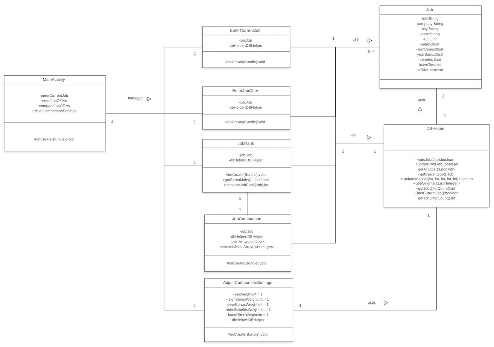
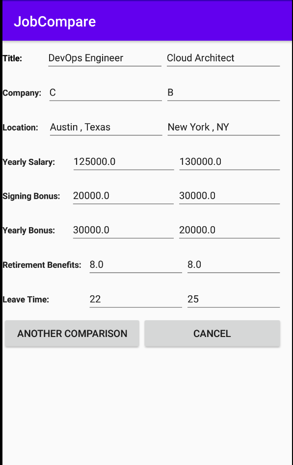
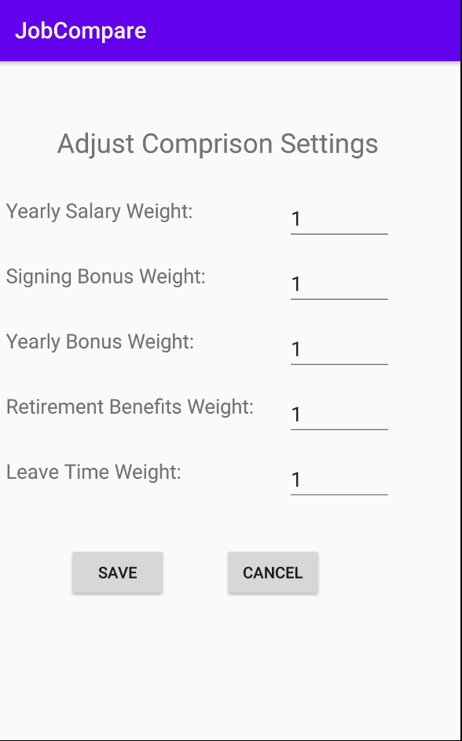
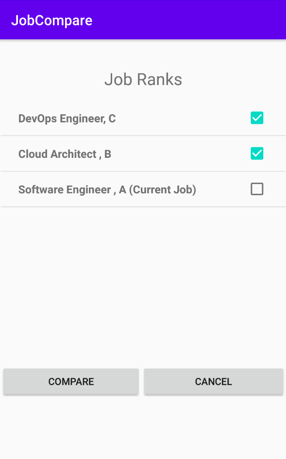

## UserManual - JobCompare - Android App

###Introduction: 
JobComparison is an Android app used to compare job offers. It also has features to compare newly added job offers with current job details. App factors cost of living index and user provided comparison settings to compute adjusted values of salary components and perform comparison when requested.

###Class Diagram:

###Use Case Diagram:

###Main Menu:

The app offers below 4 key features from main menu

- ENTER CURRENT JOB
- ENTER JOB OFFERS
- ADJUST COMPARISON SETTINGS
- COMPARE JOB OFFERS

**1. ENTER CURRENT JOB:** User can use this feature to enter details of current job. Selecting this opens a new screen "Enter Current Job Details". If current job information is already available, same is displayed on this screen. Otherwise, you can provide information as per UI prompts and save it using "SAVE" button. Saving current job information would display a toast "Current job details updated successfully" on UI. User at any point of time can click on "CANCEL" button and app will be navigated backed to MENU screen. App has implemented field level validations for all job details. Numerical fields viz., Cost of Living Index, Yearly Salary, Signing Bonus, Retirement Benefits and Leave Time are initialized to 0 and 0.0 as applicable for user convenience. In the entire form, only "Title" and "Company" are mandatory fields. Rest all fields are optional for user entry.

**2. ENTER JOB OFFERS:** Selecting this option on main menu "MENU" navigates user to "Enter Job Offers" screen. On this screen, you can enter information about job offers. Only "Title" and "Company" fields are mandatory, rest all information is optional. When user enters job offer details and click on "SAVE" button, entered data will be saved to database and a message "Job Offer saved successfully!".

 **a. ENTER ANOTHER OFFER:** User can use this option to enter a new job offer information.
  
  **b. COMPARE WITH CURRENT JOB:** User can use this option to compare most recently added job offer with current job information available on the screen.

 - BACK: This option will navigate the app back to "Enter Job Offers"
 - CANCEL: This option will navigate the app back to "MENU" screen

 

**c. CANCEL:** This option will navigate the app back to "MENU" screen

**3. ADJUST COMPARISON SETTINGS:** Selecting this option on main menu "MENU" navigates user to "Adjust Comparison Settings". By default, this screen displays integer weights currently set for each of benefits' components viz., Yearly Salary, Signing Bonus, Yearly Bonus, Retirement Benefits and Leave Time. User can provide updated integer weights for either of these components and save to database from this screen.
 - SAVE: This option will save the provided integer weights to database
 - CANCEL: This option will navigate the app back to to "MENU" screen
 
 

**4. COMPARE JOB OFFERS:** Selecting this option on main menu "MENU" navigates user to "Job Ranks" screen. By default, this screen display the complete list of job offers and current job in descending order of its score/rank. The job item at the top of this list is considered to be the best ranked job. The list displays Title and Company for each job offer. Current job is clearly identified by "(Current Job)" on this list. 

User has to select two items from this list and select "COMPARE" option to display the comparison in tabular format. If user selection is not 2, "COMPARE" button will be disabled and a prompt "Please select two jobs." is displayed. Selecting "CANCEL" option on "Job Ranks" screen navigates user back to "MENU". Also, user can use "ANOTER COMPARISON" option to perform another comparison after displaying job comparison in tabular format.

 

